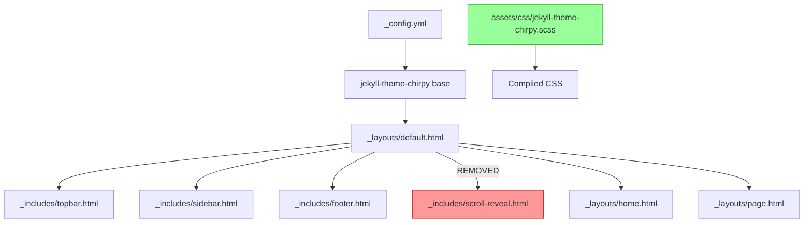

# Design Document: Minimalist Site Redesign

## Overview

This design transforms the existing Jekyll portfolio site from a visually rich, multi-effect aesthetic into a minimalist, content-focused design. The redesign targets the custom SCSS stylesheet (`assets/css/jekyll-theme-chirpy.scss`), three layout files (`default.html`, `home.html`, `page.html`), and four include files (`sidebar.html`, `topbar.html`, `footer.html`, `scroll-reveal.html`).

The approach preserves the jekyll-theme-chirpy v6.2.3 base theme import and all existing content/functionality while dramatically simplifying the visual layer. Key changes include reducing the color palette from 14+ variables to 5 core values, unifying typography under a single sans-serif family, flattening all card and container styling, removing scroll-reveal animations, and simplifying navigation to plain text links.

### Design Rationale

The current site uses gradients, backdrop-filter blurs, box-shadows, scroll-triggered animations, pill-shaped navigation, and multiple font families. While visually polished, these compete for attention and increase cognitive load. The minimalist redesign strips these to let content breathe, improving readability and reducing CSS complexity.

---

## Architecture

The redesign operates entirely within the existing Jekyll architecture. No new gems, plugins, or build tools are introduced.



### Change Scope

| File | Change Type | Description |
|------|-------------|-------------|
| `assets/css/jekyll-theme-chirpy.scss` | **Rewrite** | Replace all custom CSS with minimalist stylesheet |
| `_layouts/home.html` | **Restructure** | Reduce to 4 single-column sections |
| `_layouts/default.html` | **Minor edit** | Remove scroll-reveal include |
| `_includes/topbar.html` | **Simplify** | Remove kicker, flatten nav links |
| `_includes/sidebar.html` | **Simplify** | Remove subtitle and collaboration note |
| `_includes/footer.html` | **Simplify** | Remove tagline text |
| `_includes/scroll-reveal.html` | **Delete** | No longer loaded |

---

## Components and Interfaces

### 1. Color System (SCSS Custom Properties)

The palette is reduced from 14 variables to 5 core variables plus derived values.

```scss
:root {
  /* 5 Core Colors */
  --site-bg: #f5f5f4;        /* stone-100, saturation ~2% */
  --site-surface: #fafaf9;   /* stone-50, saturation ~2% */
  --site-text: #1c1917;      /* stone-900 */
  --site-muted: #78716c;     /* stone-500 */
  --site-accent: #176b6d;    /* teal, carried from current */

  /* Derived (transparency/lightness only, no new hues) */
  --site-border: rgba(28, 25, 23, 0.08);
  --site-accent-hover: #0f5557; /* accent darkened ~15% */
}
```

**Decision**: The warm stone palette (low saturation, ~2%) replaces the current cream/teal/orange multi-hue system. The single accent color (teal) is retained for all interactive elements because it already has strong brand recognition on the site.

### 2. Typography System

```scss
:root {
  --font-family: 'IBM Plex Sans', -apple-system, BlinkMacSystemFont, 'Segoe UI', sans-serif;
}
```

| Element | Font Size | Font Weight | Line Height |
|---------|-----------|-------------|-------------|
| Body text | 1.0625rem (17px) | 400 | 1.7 |
| h1 | 2.25rem | 700 | 1.15 |
| h2 | 1.75rem | 600 | 1.2 |
| h3 | 1.375rem | 600 | 1.3 |
| h4 | 1.125rem | 500 | 1.4 |

**Decision**: A single sans-serif family (IBM Plex Sans, already loaded) replaces the dual Fraunces/IBM Plex Sans system. This eliminates one font load and creates visual uniformity. The heading hierarchy maintains at least 0.25rem and 100 weight units between each level.

Content max-width: **700px** (within the 680–720px range for optimal line length).

### 3. Layout: Home Page (`_layouts/home.html`)

Restructured to exactly 4 single-column sections:

```
┌─────────────────────────────────┐
│  Section 1: Introduction        │
│  - Headline (max 12 words)      │
│  - Description (max 50 words)   │
│  - CTA button                   │
├─────────────────────────────────┤
│  Section 2: Services Summary    │
│  - Vertically stacked list      │
│  - No icons                     │
│  - Plain text descriptions      │
├─────────────────────────────────┤
│  Section 3: Selected Work       │
│  - 2-3 project cards            │
│  - Single column stack          │
├─────────────────────────────────┤
│  Section 4: Contact CTA         │
│  - Short prompt                 │
│  - Email + LinkedIn buttons     │
└─────────────────────────────────┘
```

**Removed elements**: hero-panel side column, quick-facts grid, "Why visitors stay" panel, "Explore the site" directory section, teaching & community section (accessible via nav), split-section layout.

### 4. Navigation: Topbar (`_includes/topbar.html`)

**Before**: Pill-shaped nav links with background fills, kicker text, backdrop-filter blur, box-shadow container.

**After**: Flat container, plain text links, underline-only active state.

```html
<header id="topbar-wrapper" aria-label="Top Bar">
  <div id="topbar">
    <div class="topbar-main">
      <div id="topbar-title">{{ page.title | default: site.title }}</div>
      <div class="topbar-actions">
        <a href="/contact/" class="btn btn-primary btn-sm topbar-cta">Contact</a>
        <button type="button" id="sidebar-trigger" class="btn btn-link topbar-menu" aria-label="Open profile panel">
          <i class="fas fa-bars fa-fw"></i>
        </button>
      </div>
    </div>
    <nav class="topbar-nav" aria-label="Primary navigation">
      <!-- Plain text links, no pill backgrounds -->
    </nav>
  </div>
</header>
```

Nav link styling:
- Default: `color: var(--site-text); background: none; border: none;`
- Hover/Focus: `color: var(--site-accent);` (text color change only)
- Active: `border-bottom: 2px solid var(--site-accent);` (underline indicator)

### 5. Sidebar (`_includes/sidebar.html`)

Simplified to show only:
- Avatar image
- Site title (linked to home)
- Contact icon links

**Removed**: subtitle paragraph, `.sidebar-note` collaboration text, backdrop-filter blur.

### 6. Card Components

All card types (`.section-card`, `.project-card`, `.fact-card`) share flat styling:

```scss
.section-card,
.project-card,
.fact-card {
  background: var(--site-surface);
  border: 1px solid var(--site-border);
  border-radius: 6px;
  padding: 1.25rem;
  /* No box-shadow, no transform, no transition */
}
```

Hover state limited to subtle border-color change only:
```scss
.section-card:hover,
.project-card:hover {
  border-color: rgba(28, 25, 23, 0.16);
}
```

### 7. Footer (`_includes/footer.html`)

```html
<footer aria-label="Site Info" class="site-footer">
  <p>© 2025 Abel Kristanto Widodo.</p>
  <p class="footer-links">
    <a href="mailto:abelkrw@gmail.com">Email</a>
    <span>·</span>
    <a href="https://www.linkedin.com/in/abelkrw" target="_blank" rel="noopener noreferrer">LinkedIn</a>
    <span>·</span>
    <a href="https://github.com/AbelKristanto" target="_blank" rel="noopener noreferrer">GitHub</a>
  </p>
</footer>
```

Styling: `font-size: 0.88rem; color: var(--site-muted); margin-top: 2rem;`

### 8. Scroll Reveal Removal

- `_includes/scroll-reveal.html` is no longer included in `_layouts/default.html`
- CSS sets `.reveal-on-scroll { opacity: 1; transform: none; }` as a safety fallback
- The `reveal-ready` class on `<html>` becomes inert

---

## Data Models

No data model changes. The site uses Jekyll's existing data structures:
- `_config.yml` for site configuration
- `_data/contact.yml` for social links
- `_tabs/` collection for navigation pages
- `_posts/` for blog content

All content files remain unchanged. The redesign is purely presentational.

---

## Error Handling

| Scenario | Handling |
|----------|----------|
| Font fails to load | CSS fallback stack: `-apple-system, BlinkMacSystemFont, 'Segoe UI', sans-serif` |
| Browser doesn't support CSS custom properties | Chirpy base theme provides fallback styling |
| JavaScript disabled | No scroll-reveal script loaded; all content visible by default |
| Old cached CSS served | Jekyll asset pipeline uses cache-busting via Sass compilation |
| Sidebar toggle fails on mobile | Sidebar remains accessible via Chirpy's built-in JS toggle mechanism |

---

## Testing Strategy

### Why Property-Based Testing Does Not Apply

This feature consists entirely of:
- **Declarative CSS configuration** (color values, spacing, typography)
- **UI rendering and layout** (grid structures, responsive breakpoints)
- **Static HTML structural changes** (removing/adding elements)
- **Configuration validation** (checking specific CSS property values)

None of these involve pure functions with varying inputs where universal properties could be tested across a wide input space. The acceptance criteria are verifiable through static analysis of CSS output and structural checks of HTML templates.

### Testing Approach

**1. Visual Regression Tests (Primary)**
- Screenshot comparison of key pages (Home, About, What I Do, Teaching & Community) at 3 viewport widths (375px, 768px, 1440px)
- Compare before/after to catch unintended regressions
- Tool: Percy, BackstopJS, or manual screenshot comparison

**2. CSS Audit Tests (Automated)**
- Parse compiled CSS and verify:
  - Exactly 5 core color variables defined
  - No `box-shadow` on card selectors
  - No `backdrop-filter` on topbar/sidebar
  - No `transition` on card/nav elements
  - `border-radius` values ≤ 8px on cards
  - Content max-width between 680–720px
  - Body font-size ≥ 1rem
- Tool: Custom Node.js script using `postcss` to parse compiled CSS

**3. HTML Structure Tests (Automated)**
- Verify `scroll-reveal.html` not included in default layout
- Verify sidebar HTML lacks subtitle and sidebar-note
- Verify footer lacks tagline text
- Verify topbar lacks kicker element
- Verify home page has ≤ 4 top-level sections
- Verify semantic landmarks preserved (header, nav, main, aside, footer with aria-labels)
- Tool: `html-proofer` gem (already in Gemfile) + custom checks

**4. Accessibility Tests**
- Color contrast verification: all text/background pairs meet WCAG AA (4.5:1 normal, 3:1 large)
- Focus-visible outlines present on all interactive elements (≥ 2px width, ≥ 2px offset)
- Skip-link functional (hidden by default, visible on focus, targets #main-content)
- Touch targets ≥ 44×44px on mobile nav links
- Tool: axe-core, Lighthouse accessibility audit

**5. Performance Tests**
- Verify compiled CSS file is smaller than current (line count reduction)
- Verify CSS transfer size ≤ 50KB compressed
- Verify LCP ≤ 2500ms on standard connection
- Tool: Lighthouse CI, `wc -l` for line count comparison

**6. Responsive Layout Tests**
- At 767px and below: all grids collapse to single column
- At 767px and below: horizontal padding is 1rem–1.25rem
- At 767px and below: body text remains ≥ 1rem
- At 767px and below: no horizontal overflow
- Tool: Browser DevTools responsive mode, or Playwright viewport testing

### Test Execution

```bash
# Build the site
bundle exec jekyll build

# Run HTML proofer (existing)
bundle exec htmlproofer ./_site --disable-external

# Run CSS audit (new script)
node tests/css-audit.js

# Run Lighthouse (manual or CI)
npx lighthouse https://localhost:4000 --only-categories=accessibility,performance
```
