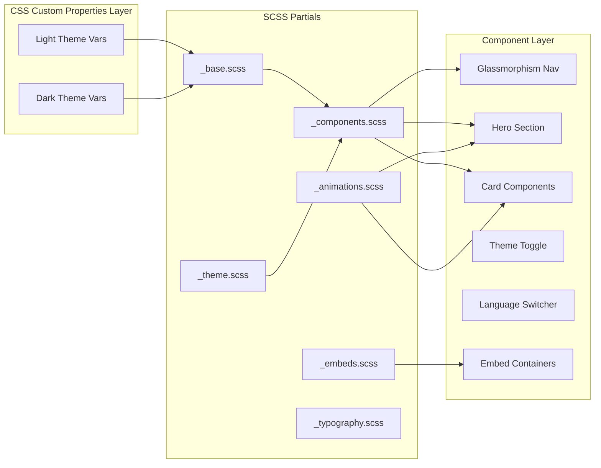

# Design Document: Premium Site Overhaul

## Overview

This design transforms Abel Kristanto Widodo's Jekyll portfolio from its current minimalist Chirpy-based layout into a premium, visually engaging site with three major capabilities:

1. **Premium Visual Design** — Gradient system, glassmorphism navigation, dark/light theme toggle, animated hero section, modern card components, and scroll-reveal micro-animations
2. **Multi-Language Support** — English (default), Indonesian, and Chinese via jekyll-polyglot v1.12.0 with a topbar language switcher
3. **Embedded Content System** — Responsive iframe containers for Streamlit apps, Tableau dashboards, YouTube videos, and GitBook materials

The implementation builds on the existing custom layouts (`default.html`, `home.html`, `page.html`), includes (`sidebar.html`, `topbar.html`, `footer.html`), and SCSS (`jekyll-theme-chirpy.scss`). The site continues to use jekyll-theme-chirpy v6.2.3 as the base theme gem, deployed via the existing GitHub Actions workflow.

### Key Research Findings

**Polyglot + Chirpy Compatibility** (source: [aturret.space guide](https://aturret.space/posts/Customize-Bilingual-Blog-with-Chirpy-Theme/)):
- Chirpy uses `site.lang` for locale lookups in `_data/locales/`. Polyglot sets `site.active_lang` per-build. All template references to `site.lang` must be replaced with `site.active_lang` for localized rendering.
- The `static_href` Liquid block tag is required for language switcher links to prevent Polyglot from relativizing URLs incorrectly.
- `parallel_localization` must be set to `false` in `_config.yml` for GitHub Actions builds — the parallel mode forks one process per language and can overwhelm CI runners or cause race conditions.
- A custom fork of `jekyll-seo-tag` (polyglot-aware) is recommended for correct `<meta>` tag localization, or alternatively, manual `hreflang` link injection in `head.html`.

**GitHub Pages Deployment**:
- Since the site uses a custom GitHub Actions workflow (not the default Pages build), jekyll-polyglot can be used as a standard plugin — it is not restricted to the GitHub Pages whitelist.
- The workflow builds with `bundle exec jekyll b` and runs `htmlproofer`. Polyglot will generate `/id/` and `/zh/` subdirectories in `_site/`.

---

## Architecture

### High-Level Architecture

```mermaid
graph TB
    subgraph "Jekyll Build Pipeline"
        CONFIG[_config.yml<br/>polyglot config] --> BUILD[Jekyll Build]
        LAYOUTS[_layouts/] --> BUILD
        INCLUDES[_includes/] --> BUILD
        SCSS[assets/css/] --> BUILD
        DATA[_data/en,id,zh/] --> BUILD
        POSTS[_posts/, _posts/id/, _posts/zh/] --> BUILD
        JS[assets/js/] --> BUILD
    end

    subgraph "Polyglot Processing"
        BUILD --> EN_SITE[_site/ (English root)]
        BUILD --> ID_SITE[_site/id/ (Indonesian)]
        BUILD --> ZH_SITE[_site/zh/ (Chinese)]
    end

    subgraph "Client-Side Runtime"
        THEME_JS[theme-toggle.js] --> LOCAL_STORAGE[(localStorage)]
        SCROLL_JS[scroll-reveal.js] --> IO[Intersection Observer]
        EMBED_JS[embed-loader.js] --> IFRAMES[iframe elements]
    end

    EN_SITE --> DEPLOY[GitHub Pages]
    ID_SITE --> DEPLOY
    ZH_SITE --> DEPLOY
```

### Design System Architecture



### File Structure

```
├── _config.yml                          # + polyglot config
├── Gemfile                              # + jekyll-polyglot gem
├── _data/
│   ├── en/
│   │   └── strings.yml                  # English UI strings
│   ├── id/
│   │   └── strings.yml                  # Indonesian UI strings
│   └── zh/
│       └── strings.yml                  # Chinese UI strings
├── _includes/
│   ├── topbar.html                      # + language switcher, theme toggle
│   ├── sidebar.html                     # (updated for active_lang)
│   ├── footer.html                      # (updated for active_lang)
│   ├── embed-container.html             # NEW: reusable embed include
│   ├── head-fonts.html                  # NEW: conditional font loading
│   ├── theme-toggle.html                # NEW: toggle button markup
│   ├── language-switcher.html           # NEW: switcher component
│   └── scroll-reveal.html              # (existing, enhanced)
├── _layouts/
│   ├── default.html                     # + theme class, font includes
│   ├── home.html                        # + premium hero section
│   └── page.html                        # (minor updates)
├── _posts/
│   ├── (existing English posts)
│   ├── id/                              # Indonesian post translations
│   └── zh/                              # Chinese post translations
├── _sass/
│   ├── premium/
│   │   ├── _variables.scss              # CSS custom properties
│   │   ├── _theme-light.scss            # Light theme values
│   │   ├── _theme-dark.scss             # Dark theme values
│   │   ├── _typography.scss             # Font system
│   │   ├── _glassmorphism.scss          # Glass effects
│   │   ├── _cards.scss                  # Card components
│   │   ├── _hero.scss                   # Hero section
│   │   ├── _animations.scss             # Micro-animations
│   │   ├── _embeds.scss                 # Embed containers
│   │   ├── _navigation.scss             # Sticky nav + hamburger
│   │   └── _responsive.scss             # Breakpoint overrides
│   └── premium.scss                     # Barrel import file
├── assets/
│   ├── css/
│   │   └── jekyll-theme-chirpy.scss     # + @import 'premium'
│   └── js/
│       ├── theme-toggle.js              # Theme switching logic
│       ├── embed-loader.js              # Iframe loading + fallback
│       └── scroll-reveal.js             # (replaces inline script)
└── .github/
    └── workflows/
        └── pages-deploy.yml             # (unchanged)
```

---

## Components and Interfaces

### 1. Design System (CSS Custom Properties)

The design system is defined entirely through CSS custom properties on `:root` and `[data-theme="dark"]`, enabling instant theme switching without page reload.

```scss
// _sass/premium/_variables.scss
:root {
  // Primary palette (light)
  --color-primary: #176b6d;
  --color-secondary: #2d4a7a;
  --color-accent: #e85d3a;
  --color-bg: #f8f6f2;
  --color-surface: #ffffff;
  --color-text: #1c1917;
  --color-text-muted: #6b6560;

  // Gradients
  --gradient-hero: linear-gradient(135deg, #176b6d 0%, #2d4a7a 50%, #1a3d5c 100%);
  --gradient-section: linear-gradient(180deg, rgba(248,246,242,0.9) 0%, rgba(255,255,255,0.95) 100%);
  --gradient-card-hover: linear-gradient(145deg, rgba(23,107,109,0.03) 0%, rgba(45,74,122,0.03) 100%);

  // Glassmorphism
  --glass-bg: rgba(255, 255, 255, 0.78);
  --glass-blur: 12px;
  --glass-border: rgba(255, 255, 255, 0.3);

  // Shadows
  --shadow-card: 0 1px 3px rgba(0,0,0,0.04), 0 4px 12px rgba(0,0,0,0.03);
  --shadow-card-hover: 0 4px 8px rgba(0,0,0,0.06), 0 12px 28px rgba(0,0,0,0.05);

  // Radii
  --radius-card: 16px;
  --radius-button: 10px;
  --radius-input: 8px;

  // Typography scale
  --text-xs: clamp(0.75rem, 0.7rem + 0.2vw, 0.8rem);
  --text-sm: clamp(0.85rem, 0.8rem + 0.2vw, 0.9rem);
  --text-base: clamp(0.98rem, 0.92rem + 0.22vw, 1.08rem);
  --text-lg: clamp(1.1rem, 1rem + 0.35vw, 1.25rem);
  --text-xl: clamp(1.4rem, 1.2rem + 0.6vw, 1.75rem);
  --text-2xl: clamp(1.8rem, 1.5rem + 1vw, 2.5rem);
  --text-3xl: clamp(2.2rem, 1.8rem + 1.5vw, 3.5rem);
  --text-4xl: clamp(2.8rem, 2.2rem + 2vw, 4rem);

  // Transitions
  --transition-fast: 150ms ease;
  --transition-base: 200ms ease;
  --transition-slow: 300ms ease-out;
}

[data-theme="dark"] {
  --color-primary: #4fd1c5;
  --color-secondary: #63b3ed;
  --color-accent: #fc8181;
  --color-bg: #0f1419;
  --color-surface: #1a2332;
  --color-text: #e8e6e3;
  --color-text-muted: #9ca3af;

  --gradient-hero: linear-gradient(135deg, #0f2027 0%, #203a43 50%, #2c5364 100%);
  --gradient-section: linear-gradient(180deg, rgba(15,20,25,0.95) 0%, rgba(26,35,50,0.9) 100%);
  --gradient-card-hover: linear-gradient(145deg, rgba(79,209,197,0.04) 0%, rgba(99,179,237,0.04) 100%);

  --glass-bg: rgba(15, 20, 25, 0.82);
  --glass-blur: 12px;
  --glass-border: rgba(255, 255, 255, 0.08);

  --shadow-card: 0 1px 3px rgba(0,0,0,0.2), 0 4px 12px rgba(0,0,0,0.15);
  --shadow-card-hover: 0 4px 8px rgba(0,0,0,0.3), 0 12px 28px rgba(0,0,0,0.2);
}
```

### 2. Theme Toggle Component

**Interface**: `_includes/theme-toggle.html`

```html
<button id="theme-toggle" class="theme-toggle-btn" 
        aria-label="{{ site.data[site.active_lang].strings.theme_toggle_label }}"
        type="button">
  <span class="theme-toggle-icon theme-toggle-icon--sun" aria-hidden="true">☀️</span>
  <span class="theme-toggle-icon theme-toggle-icon--moon" aria-hidden="true">🌙</span>
</button>
```

**Logic**: `assets/js/theme-toggle.js`

```javascript
// Initialization (runs in <head> to prevent FOUC)
(function() {
  const STORAGE_KEY = 'site-theme';
  const stored = localStorage.getItem(STORAGE_KEY);
  const preferred = window.matchMedia('(prefers-color-scheme: dark)').matches ? 'dark' : 'light';
  const theme = stored || preferred;
  document.documentElement.setAttribute('data-theme', theme);
})();

// Toggle handler (runs after DOM ready)
document.addEventListener('DOMContentLoaded', function() {
  const STORAGE_KEY = 'site-theme';
  const toggle = document.getElementById('theme-toggle');
  
  toggle.addEventListener('click', function() {
    const current = document.documentElement.getAttribute('data-theme');
    const next = current === 'dark' ? 'light' : 'dark';
    document.documentElement.setAttribute('data-theme', next);
    localStorage.setItem(STORAGE_KEY, next);
  });

  // Listen for system preference changes
  window.matchMedia('(prefers-color-scheme: dark)').addEventListener('change', function(e) {
    if (!localStorage.getItem(STORAGE_KEY)) {
      document.documentElement.setAttribute('data-theme', e.matches ? 'dark' : 'light');
    }
  });
});
```

### 3. Language Switcher Component

**Interface**: `_includes/language-switcher.html`

```html
<div class="lang-switcher" role="navigation" aria-label="{{ site.data[site.active_lang].strings.language_switcher_label }}">
  <button class="lang-switcher__trigger" aria-expanded="false" aria-haspopup="listbox">
    <span class="lang-switcher__current">{{ site.data[site.active_lang].strings.lang_name_short }}</span>
    <svg class="lang-switcher__chevron" width="12" height="12" aria-hidden="true">
      <path d="M2 4l4 4 4-4" stroke="currentColor" fill="none" stroke-width="1.5"/>
    </svg>
  </button>
  <ul class="lang-switcher__menu" role="listbox">
    
      <li role="option" aria-selected="true">
        
          <span class="lang-switcher__option lang-switcher__option--active">
            {{ site.data[tongue].strings.lang_name }}
          </span>
        
          <a class="lang-switcher__option" 
             href="{{ site.baseurl }}{{ page.url }}{{ site.baseurl }}/{{ tongue }}{{ page.url }}">
            {{ site.data[tongue].strings.lang_name }}
          </a>
        
      </li>
    
  </ul>
</div>
```

**Key Design Decisions**:
- Uses `` block tag from Polyglot to prevent URL relativization
- Falls back to homepage if target page doesn't exist (handled via 404 redirect at server level, with client-side JS fallback)
- Dropdown pattern with `aria-expanded` and `role="listbox"` for accessibility
- Minimum 44×44px touch targets on mobile

### 4. Glassmorphism Navigation

**Behavior**: The topbar becomes a sticky glassmorphism bar that blurs the content behind it as the user scrolls.

```scss
// _sass/premium/_glassmorphism.scss
#topbar-wrapper {
  background: var(--glass-bg);
  backdrop-filter: blur(var(--glass-blur));
  -webkit-backdrop-filter: blur(var(--glass-blur));
  border-bottom: 1px solid var(--glass-border);
  position: sticky;
  top: 0;
  z-index: 1000;
  transition: background var(--transition-slow), box-shadow var(--transition-slow);

  // Fallback for browsers without backdrop-filter
  @supports not (backdrop-filter: blur(1px)) {
    background: var(--color-surface);
    opacity: 0.94;
  }
}
```

### 5. Embed Container System

**Interface**: `_includes/embed-container.html`

Parameters:
- `src` (required): iframe URL
- `type`: `video` (16:9), `dashboard` (4:3), `app` (fixed-height), `document` (fixed-height tall)
- `title` (required): accessible title for the iframe
- `fallback_url`: direct link for fallback
- `fallback_text`: message shown on load failure

```html

<div class="embed-container embed-container--{{ aspect_class }}" data-embed-src="{{ include.src }}">
  <div class="embed-container__loader" aria-hidden="true">
    <div class="embed-container__spinner"></div>
  </div>
  <iframe 
    class="embed-container__iframe"
    data-src="{{ include.src }}"
    loading="lazy"
    title="{{ include.title }}"
    frameborder="0"
    allowfullscreen
    sandbox="allow-scripts allow-same-origin allow-popups"
    style="opacity: 0;"
  ></iframe>
  <div class="embed-container__fallback" hidden>
    <p>{{ include.fallback_text | default: site.data[site.active_lang].strings.embed_unavailable }}</p>
    <a href="{{ include.fallback_url | default: include.src }}" target="_blank" rel="noopener noreferrer" class="btn btn-primary">
      {{ site.data[site.active_lang].strings.embed_open_external }}
    </a>
  </div>
</div>
```

**JavaScript**: `assets/js/embed-loader.js`

```javascript
document.addEventListener('DOMContentLoaded', function() {
  const TIMEOUT_MS = 10000;

  document.querySelectorAll('.embed-container').forEach(function(container) {
    const iframe = container.querySelector('.embed-container__iframe');
    const loader = container.querySelector('.embed-container__loader');
    const fallback = container.querySelector('.embed-container__fallback');
    const src = iframe.getAttribute('data-src');

    if (!src) return;

    // Set src to begin loading
    iframe.src = src;

    // Timeout fallback
    const timer = setTimeout(function() {
      iframe.style.display = 'none';
      loader.style.display = 'none';
      fallback.hidden = false;
    }, TIMEOUT_MS);

    iframe.addEventListener('load', function() {
      clearTimeout(timer);
      loader.style.display = 'none';
      iframe.style.opacity = '1';
    });

    iframe.addEventListener('error', function() {
      clearTimeout(timer);
      iframe.style.display = 'none';
      loader.style.display = 'none';
      fallback.hidden = false;
    });
  });
});
```

### 6. Scroll Reveal System

Enhances the existing `_includes/scroll-reveal.html` with configurable animation parameters:

```javascript
// assets/js/scroll-reveal.js
(function() {
  const THRESHOLD = 0.2;
  const ROOT_MARGIN = '0px 0px -10% 0px';
  const SELECTORS = [
    '.home-section', '.content > h2', '.content > h3',
    '.content > p', '.content > ul', '.content > ol',
    '.section-card', '.project-card', '.embed-container'
  ];

  const reduceMotion = window.matchMedia('(prefers-reduced-motion: reduce)');

  function init() {
    const elements = document.querySelectorAll(SELECTORS.join(','));
    
    if (reduceMotion.matches || !('IntersectionObserver' in window)) {
      elements.forEach(el => el.classList.add('is-visible'));
      return;
    }

    const observer = new IntersectionObserver(function(entries) {
      entries.forEach(function(entry) {
        if (entry.isIntersecting) {
          entry.target.classList.add('is-visible');
          observer.unobserve(entry.target);
        }
      });
    }, { threshold: THRESHOLD, rootMargin: ROOT_MARGIN });

    elements.forEach(function(el, i) {
      el.classList.add('reveal-on-scroll');
      el.style.setProperty('--reveal-delay', Math.min(i * 60, 240) + 'ms');
      observer.observe(el);
    });
  }

  if (document.readyState === 'loading') {
    document.addEventListener('DOMContentLoaded', init);
  } else {
    init();
  }
})();
```

### 7. Font Loading Strategy

**Interface**: `_includes/head-fonts.html`

```html
<!-- Primary fonts (Latin) - always loaded -->
<link rel="preconnect" href="https://fonts.googleapis.com">
<link rel="preconnect" href="https://fonts.gstatic.com" crossorigin>
<link rel="preload" as="style" 
      href="https://fonts.googleapis.com/css2?family=Plus+Jakarta+Sans:wght@400;500;600;700;800&family=Playfair+Display:wght@600;700;800&display=swap">
<link rel="stylesheet" 
      href="https://fonts.googleapis.com/css2?family=Plus+Jakarta+Sans:wght@400;500;600;700;800&family=Playfair+Display:wght@600;700;800&display=swap">

<!-- CJK font - loaded only for Chinese locale -->

<link rel="preload" as="style"
      href="https://fonts.googleapis.com/css2?family=Noto+Sans+SC:wght@400;500;700&display=swap">
<link rel="stylesheet"
      href="https://fonts.googleapis.com/css2?family=Noto+Sans+SC:wght@400;500;700&display=swap">

```

**Typography SCSS**:
```scss
// _sass/premium/_typography.scss
:root {
  --font-heading: 'Playfair Display', Georgia, serif;
  --font-body: 'Plus Jakarta Sans', -apple-system, BlinkMacSystemFont, 'Segoe UI', sans-serif;
  --font-cjk: 'Noto Sans SC', 'PingFang SC', 'Microsoft YaHei', sans-serif;
}

[lang="zh"] {
  --font-body: var(--font-cjk);
  --font-heading: var(--font-cjk);
}

h1 { font-family: var(--font-heading); font-size: var(--text-4xl); font-weight: 700; letter-spacing: -0.02em; line-height: 1.1; }
h2 { font-family: var(--font-heading); font-size: var(--text-2xl); font-weight: 700; letter-spacing: -0.01em; line-height: 1.2; }
h3 { font-family: var(--font-heading); font-size: var(--text-xl); font-weight: 600; letter-spacing: 0; line-height: 1.3; }
h4 { font-family: var(--font-body); font-size: var(--text-lg); font-weight: 600; letter-spacing: 0.01em; line-height: 1.4; }
body { font-family: var(--font-body); font-size: var(--text-base); line-height: 1.7; }
```

---

## Data Models

### Locale File Structure

Each language has a `strings.yml` file under `_data/{lang}/`:

```yaml
# _data/en/strings.yml
lang_name: "English"
lang_name_short: "EN"

# Navigation
nav_home: "Home"
nav_about: "About"
nav_categories: "Categories"
nav_tags: "Tags"
nav_archives: "Archives"

# Theme toggle
theme_toggle_label: "Toggle dark/light theme"

# Language switcher
language_switcher_label: "Select language"

# Hero section
hero_eyebrow: "Data & AI Professional"
hero_title: "Data and AI work that people can understand and use."
hero_description: "I help teams make better decisions through analytics, AI, and automation — and help people learn faster through practical education."
hero_cta_primary: "Learn more about me"
hero_cta_secondary: "View my work"

# Stats
stat_professionals: "Professionals Reached"
stat_learners: "Learners Mentored"
stat_automation: "Automation Initiatives"
stat_publications: "Publications"

# Embeds
embed_unavailable: "This content is currently unavailable."
embed_open_external: "Open in new tab"
embed_fullscreen: "Toggle fullscreen"
embed_loading: "Loading..."

# Footer
footer_copyright: "All rights reserved."

# Untranslated content notice
untranslated_notice: "This content is not yet available in your selected language. Showing the original version."
```

```yaml
# _data/id/strings.yml
lang_name: "Bahasa Indonesia"
lang_name_short: "ID"

nav_home: "Beranda"
nav_about: "Tentang"
nav_categories: "Kategori"
nav_tags: "Tag"
nav_archives: "Arsip"

theme_toggle_label: "Ganti tema gelap/terang"
language_switcher_label: "Pilih bahasa"

hero_eyebrow: "Profesional Data & AI"
hero_title: "Pekerjaan Data dan AI yang mudah dipahami dan digunakan."
hero_description: "Saya membantu tim membuat keputusan lebih baik melalui analitik, AI, dan otomasi — serta membantu orang belajar lebih cepat melalui pendidikan praktis."
hero_cta_primary: "Pelajari lebih lanjut"
hero_cta_secondary: "Lihat karya saya"

stat_professionals: "Profesional Dijangkau"
stat_learners: "Pelajar Dibimbing"
stat_automation: "Inisiatif Otomasi"
stat_publications: "Publikasi"

embed_unavailable: "Konten ini sedang tidak tersedia."
embed_open_external: "Buka di tab baru"
embed_fullscreen: "Layar penuh"
embed_loading: "Memuat..."

footer_copyright: "Hak cipta dilindungi."
untranslated_notice: "Konten ini belum tersedia dalam bahasa yang Anda pilih. Menampilkan versi asli."
```

```yaml
# _data/zh/strings.yml
lang_name: "中文"
lang_name_short: "中"

nav_home: "首页"
nav_about: "关于"
nav_categories: "分类"
nav_tags: "标签"
nav_archives: "归档"

theme_toggle_label: "切换深色/浅色主题"
language_switcher_label: "选择语言"

hero_eyebrow: "数据与AI专业人士"
hero_title: "让人们能够理解和使用的数据与AI工作。"
hero_description: "我通过分析、AI和自动化帮助团队做出更好的决策——并通过实践教育帮助人们更快地学习。"
hero_cta_primary: "了解更多"
hero_cta_secondary: "查看作品"

stat_professionals: "触达专业人士"
stat_learners: "指导学员"
stat_automation: "自动化项目"
stat_publications: "出版物"

embed_unavailable: "此内容暂时不可用。"
embed_open_external: "在新标签页中打开"
embed_fullscreen: "全屏切换"
embed_loading: "加载中..."

footer_copyright: "版权所有。"
untranslated_notice: "此内容尚未提供您所选语言的版本。显示原始版本。"
```

### Polyglot Configuration (additions to `_config.yml`)

```yaml
# Multi-language (jekyll-polyglot)
languages: ["en", "id", "zh"]
default_lang: "en"
exclude_from_localization: ["assets", "images", "favicon", "feed.xml", "sitemap.xml"]
parallel_localization: false  # Required for GitHub Actions compatibility

# Language-specific titles/descriptions (for SEO)
lang_vars:
  en:
    title: "Abel Kristanto Widodo"
    description: "Personal website featuring work in data science, AI, automation, education, and portfolio projects."
  id:
    title: "Abel Kristanto Widodo"
    description: "Situs pribadi yang menampilkan karya di bidang data science, AI, otomasi, pendidikan, dan proyek portofolio."
  zh:
    title: "Abel Kristanto Widodo"
    description: "个人网站，展示数据科学、AI、自动化、教育和作品集项目。"
```

### Embed Configuration Data

Embeds are configured per-post via front matter:

```yaml
# Example: _posts/2023-10-04-Data-Portofolio.md front matter
---
title: Interactive Data Portfolio
embeds:
  - src: "https://dashboardabelkrw.streamlit.app/?embed=true"
    type: app
    title: "Interactive Data Portfolio - Streamlit App"
    fallback_url: "https://dashboardabelkrw.streamlit.app/?embed=true"
---
```

### Theme State Model

```
┌─────────────────────────────────────────────┐
│ Theme Resolution Order                       │
├─────────────────────────────────────────────┤
│ 1. localStorage['site-theme']               │
│ 2. prefers-color-scheme media query         │
│ 3. Default: 'light'                         │
└─────────────────────────────────────────────┘

State stored as: data-theme attribute on <html>
Values: "light" | "dark"
Persistence: localStorage key "site-theme"
```


---

## Correctness Properties

*A property is a characteristic or behavior that should hold true across all valid executions of a system — essentially, a formal statement about what the system should do. Properties serve as the bridge between human-readable specifications and machine-verifiable correctness guarantees.*

### Property 1: Color Palette Distinctness

*For any* pair of colors in the primary palette (primary, secondary, accent, background, surface), the difference in either hue (in degrees on the HSL wheel) or lightness (as a percentage) SHALL be at least 10%.

**Validates: Requirements 1.1**

### Property 2: Dark Mode WCAG Contrast Compliance

*For any* text-color and background-color pair defined in the dark theme CSS custom properties, the computed WCAG contrast ratio SHALL be at least 4.5:1 for body-sized text and at least 3:1 for large text (font-size >= 18pt or bold >= 14pt).

**Validates: Requirements 1.3**

### Property 3: Type Scale Bounds

*For any* CSS custom property in the type scale (text-xs through text-2xl), the clamp() minimum value SHALL be no less than 0.75rem and the maximum value SHALL be no greater than 4rem.

**Validates: Requirements 2.2**

### Property 4: Heading Size Hierarchy

*For any* consecutive heading level pair (h1/h2, h2/h3, h3/h4), the maximum font-size of the lower level SHALL be at least 0.25rem smaller than the minimum font-size of the higher level.

**Validates: Requirements 2.3**

### Property 5: Reduced Motion Compliance

*For any* element with a CSS transition-duration or animation-duration, when the `prefers-reduced-motion: reduce` media query is active, the duration SHALL be 0ms, except for opacity transitions required for content visibility.

**Validates: Requirements 3.5**

### Property 6: Hero Content Word Limits

*For any* locale (en, id, zh), the hero tagline string SHALL contain no more than 10 words and the hero description string SHALL contain no more than 50 words (where word boundaries are defined by whitespace for Latin scripts and by character count ÷ 2 as approximate word count for Chinese).

**Validates: Requirements 4.2**

### Property 7: Card Border Opacity Per Theme

*For any* theme variant (light or dark), the card border color's alpha channel value SHALL be between 0.05 and 0.2 inclusive.

**Validates: Requirements 5.2**

### Property 8: Consistent Border-Radius

*For any* card component, button, or input element in the design system, the applied border-radius SHALL reference the same CSS custom property value (`--radius-card`, `--radius-button`, or `--radius-input` respectively), ensuring visual consistency within each element category.

**Validates: Requirements 5.4**

### Property 9: Theme Persistence Round-Trip

*For any* theme value in {"light", "dark"}, if that value is stored in localStorage under the key "site-theme", then on page load the `data-theme` attribute on the document root element SHALL equal that stored value.

**Validates: Requirements 6.3**

### Property 10: Locale Key Completeness

*For any* key present in `_data/en/strings.yml`, that same key SHALL exist in both `_data/id/strings.yml` and `_data/zh/strings.yml` with a non-empty string value.

**Validates: Requirements 7.2, 9.1, 9.2**

### Property 11: Language Switcher URL Construction

*For any* page URL path and any target language from {en, id, zh}, the language switcher link SHALL produce a URL equal to `{baseurl}/{lang}{page_path}` for non-default languages, or `{baseurl}{page_path}` for the default language (en).

**Validates: Requirements 8.3**

### Property 12: Embed Iframe Attributes

*For any* iframe rendered by the embed container system, the iframe element SHALL include: `frameborder="0"`, `allowfullscreen`, `sandbox="allow-scripts allow-same-origin allow-popups"`, a non-empty `title` attribute, and `loading="lazy"`.

**Validates: Requirements 14.3, 12.4, 10.5, 12.3**

### Property 13: Tableau Embed URL Pattern

*For any* Tableau embed iframe in the site, the `src` attribute SHALL match the pattern `https://public.tableau.com/views/{workbook}/{view}?:embed=y&:display_count=no` where `{workbook}` and `{view}` are non-empty path segments.

**Validates: Requirements 11.2**

### Property 14: YouTube Privacy Domain

*For any* YouTube embed iframe in the site, the `src` attribute domain SHALL be `www.youtube-nocookie.com` (not `www.youtube.com`).

**Validates: Requirements 12.1**

### Property 15: Embed Type to Aspect Ratio Mapping

*For any* embed container with type "video", the container SHALL apply a 16:9 aspect ratio (padding-bottom: 56.25% or aspect-ratio: 16/9). For type "dashboard", it SHALL apply 4:3 (padding-bottom: 75% or aspect-ratio: 4/3). For type "app" or "document", it SHALL apply a fixed min-height of at least 600px on viewports >= 768px.

**Validates: Requirements 14.1, 10.3, 11.3, 12.2**

---

## Error Handling

### Theme Toggle Errors

| Scenario | Handling |
|----------|----------|
| localStorage unavailable (private browsing) | Catch exception, fall back to system preference via `prefers-color-scheme`. Theme still works but won't persist across page loads. |
| Invalid value in localStorage | Treat as no stored preference; default to system preference. |
| `prefers-color-scheme` not supported | Default to light theme. |

### Embed Loading Errors

| Scenario | Handling |
|----------|----------|
| Iframe fails to load within 10 seconds | Hide iframe, hide loading spinner, show fallback card with explanation text and direct link to external URL. |
| Iframe fires `error` event | Same as timeout — show fallback immediately. |
| `sandbox` attribute blocks required functionality | The sandbox value `allow-scripts allow-same-origin allow-popups` covers Streamlit, Tableau, YouTube, and GitBook. If a specific embed needs additional permissions, add them per-embed via the include parameter. |
| JavaScript disabled | Iframes with `data-src` won't load (JS sets `src`). Use `<noscript>` block inside embed container with direct link. |

### Language/Locale Errors

| Scenario | Handling |
|----------|----------|
| Missing translation key in locale file | Liquid template uses `| default:` filter to fall back to English value: `{{ site.data[site.active_lang].strings.key | default: site.data.en.strings.key }}` |
| Page doesn't exist in target language | Polyglot won't generate the page for that language. The language switcher link will 404. Handle with a custom 404 page per locale that redirects to the locale homepage. |
| Polyglot `static_href` tag not available | This would indicate polyglot isn't installed. The build would fail — caught by CI. |

### Font Loading Errors

| Scenario | Handling |
|----------|----------|
| Google Fonts CDN unavailable | `font-display: swap` ensures text remains visible with system fallback fonts. The font stack includes system fonts as fallbacks. |
| Noto Sans SC fails to load for Chinese locale | Chinese text renders with system CJK fonts (PingFang SC on macOS, Microsoft YaHei on Windows). |
| Font file exceeds 2MB | Use Google Fonts API which serves optimized subsets. For Noto Sans SC, request only the weights needed (400, 500, 700). |

### Build/Deployment Errors

| Scenario | Handling |
|----------|----------|
| Polyglot plugin incompatibility | Build fails with non-zero exit code. GitHub Actions workflow reports failure. Error log contains plugin name. |
| html-proofer finds broken links in localized pages | Build step fails. Fix broken internal links in locale-specific content. |
| `parallel_localization: true` causes CI failure | Set to `false` in `_config.yml`. Sequential build is slower but reliable on GitHub Actions runners. |

### Glassmorphism Fallback

| Scenario | Handling |
|----------|----------|
| Browser doesn't support `backdrop-filter` | `@supports not (backdrop-filter: blur(1px))` rule applies solid background with opacity >= 0.92. Text remains readable. |
| Browser doesn't support CSS custom properties | Extremely unlikely (IE11 only). Not supported — site requires a modern browser. |

---

## Testing Strategy

### Unit Tests (Example-Based)

Unit tests verify specific scenarios and edge cases using concrete examples:

- **Theme toggle**: Verify toggle click switches `data-theme` attribute, verify localStorage is updated, verify system preference fallback when no stored value
- **Embed loader**: Verify timeout triggers fallback after 10s, verify load event hides spinner, verify error event shows fallback
- **Language switcher**: Verify dropdown opens/closes on click, verify keyboard navigation (Tab, Enter, Space, Escape)
- **Scroll reveal**: Verify elements get `is-visible` class when intersecting, verify reduced-motion skips animation
- **Locale fallback**: Verify missing key returns English default
- **Responsive behavior**: Verify hamburger menu appears at < 768px, verify hero stacks vertically on mobile

### Property-Based Tests

Property-based tests verify universal properties across generated inputs. The project will use **fast-check** (JavaScript PBT library) for testing the client-side logic and CSS parsing.

**Configuration**: Minimum 100 iterations per property test.

**Tag format**: `Feature: premium-site-overhaul, Property {number}: {property_text}`

Properties to implement:
1. **Color palette distinctness** — Generate color palette variations, verify pairwise distance
2. **WCAG contrast compliance** — Generate text/background color pairs from dark theme, compute contrast ratios
3. **Type scale bounds** — Parse clamp() values, verify min/max bounds
4. **Heading hierarchy** — Extract heading sizes, verify monotonic decrease
5. **Reduced motion** — Parse CSS rules under prefers-reduced-motion, verify durations are 0ms
6. **Hero word limits** — Generate locale string variations, verify word counts
7. **Card border opacity** — Extract border-color alpha values per theme, verify range
8. **Theme persistence** — For random theme values, set localStorage, simulate load, verify attribute
9. **Locale key completeness** — Parse all three YAML files, verify key parity
10. **Switcher URL construction** — Generate random page paths and target languages, verify URL output
11. **Embed iframe attributes** — Generate embed configurations, render HTML, verify required attributes present
12. **Tableau URL pattern** — Generate Tableau embed URLs, verify pattern match
13. **YouTube privacy domain** — Generate YouTube embed URLs, verify nocookie domain
14. **Embed type mapping** — Generate embed type values, verify correct CSS class/aspect-ratio applied

### Integration Tests

Integration tests verify the full build pipeline and cross-component behavior:

- **Jekyll build**: Run `bundle exec jekyll build` and verify exit code 0
- **html-proofer**: Run proofer on `_site/` and verify no broken internal links
- **Locale output**: Verify `_site/id/` and `_site/zh/` directories exist with correct content
- **Asset deduplication**: Verify `_site/id/assets/` and `_site/zh/assets/` do NOT exist (assets excluded from localization)
- **Font loading**: Verify Chinese pages include Noto Sans SC link, non-Chinese pages don't
- **SEO meta tags**: Verify `<title>` and `<meta description>` differ between locale versions

### Accessibility Tests

- **axe-core**: Run automated accessibility audit on key pages (home, about, post with embeds)
- **Keyboard navigation**: Manual test of theme toggle, language switcher, hamburger menu, embed fullscreen toggle
- **Screen reader**: Manual test with VoiceOver/NVDA for aria-labels, role attributes, focus management

### Performance Tests

- **Lighthouse CI**: Automated Lighthouse audit targeting Performance >= 80 on mobile
- **Page weight**: Verify initial load < 2MB (excluding lazy-loaded iframes)
- **Render-blocking resources**: Verify <= 2 render-blocking CSS/JS in document head
- **CLS**: Verify hero section CLS < 0.1

### Visual Regression Tests (Manual)

- Screenshot comparison of light vs dark theme on key pages
- Responsive layout verification at 375px, 768px, 1024px, 1440px breakpoints
- Glassmorphism rendering across Chrome, Firefox, Safari
- Chinese typography rendering verification

