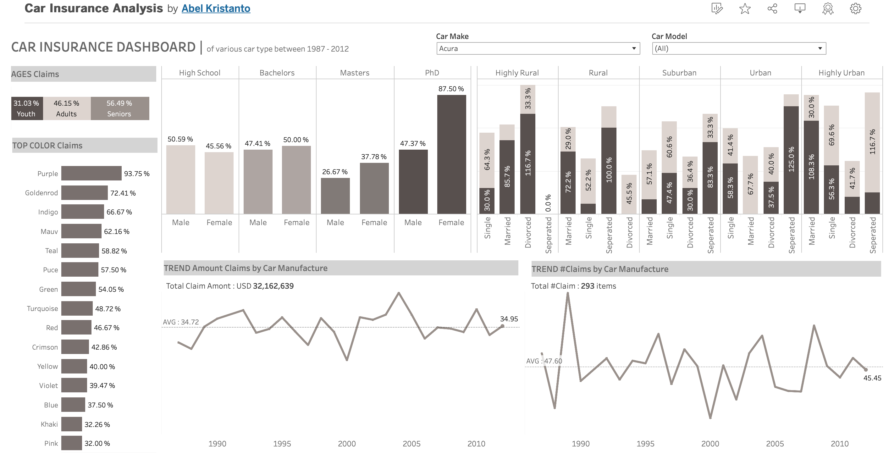
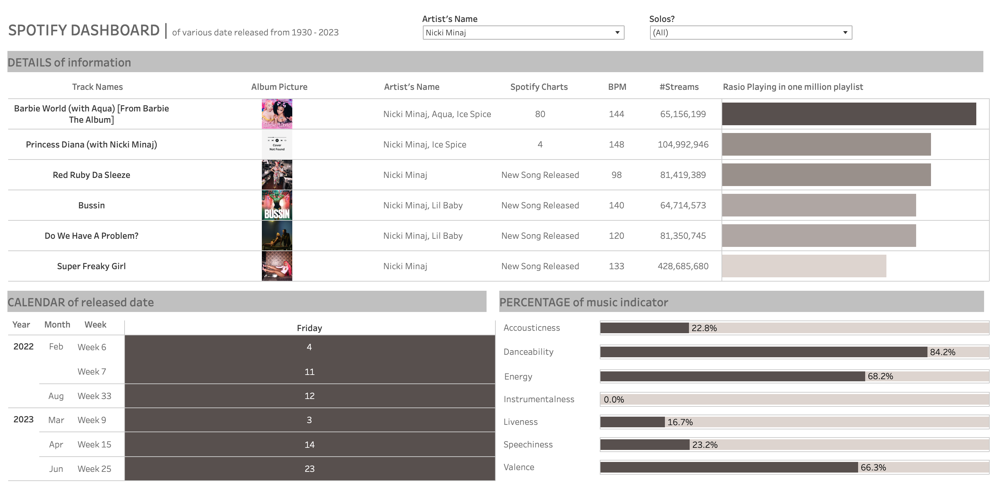
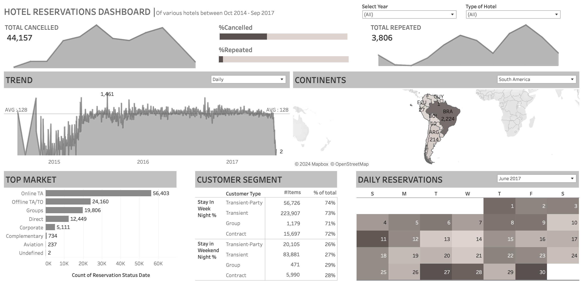

# Car Insurance Analysis

The insurance industry relies heavily on data analysis to understand patterns and trends in insurance claims. In this 
context, creating an effective dashboard is crucial for insurance companies to gain insights into customer behavior and 
vehicle-related factors that impact insurance claims. The following dashboard aims to provide a comprehensive overview 
of insurance claim patterns based on various demographic factors and vehicle attributes. Please review the dataset 
provided [here](https://onyxdata.ck.page/8cbde7b71b) and explore the dashboard below (open in [TableauPublic](https://public.tableau.com/app/profile/abel.kristanto/viz/CarInsuranceAnalysis_17100849784940/Dashboard1?publish=yes))

# Spotify Analysis

In today's digital music landscape, understanding the dynamics behind song popularity and engagement is crucial for 
artists, record labels, and streaming platforms alike. With the proliferation of streaming services like Spotify, 
providing valuable insights into listener preferences and trends.

Our analysis delves into a comprehensive dataset encompassing various attributes of songs, including track name, 
artist(s) name, release date, streaming metrics, presence on playlists and charts across different platforms, musical 
features like tempo, key, mode, danceability, energy, and more. Please review the dataset
provided [here](https://www.kaggle.com/datasets/nelgiriyewithana/top-spotify-songs-2023) and explore the dashboard below 
(open in [TableauPublic](https://public.tableau.com/app/profile/abel.kristanto/viz/SpotifyAnalysis_17101537680360/SpotifyAnalysis?publish=yes))

# Hotel Reservations Analysis

The hospitality industry thrives on meticulous data analysis to comprehend booking patterns and guest behavior, crucial 
for optimizing operations and enhancing customer experience. This dataset offers a comprehensive glimpse into the 
intricacies of hotel bookings, encompassing various factors influencing reservations and stay experiences. From the type 
of hotel and booking channels to guest demographics and reservation status, each attribute plays a pivotal role in 
shaping the dynamics of the hotel industry.

Please review the dataset provided [here](https://onyxdata.co.uk/data-dna-dataset-challenge/) and explore the dashboard 
below(open in [TableauPublic](https://public.tableau.com/app/profile/abel.kristanto/viz/HotelAnalysis_17101747388490/HotelAnalysis?publish=yes))

