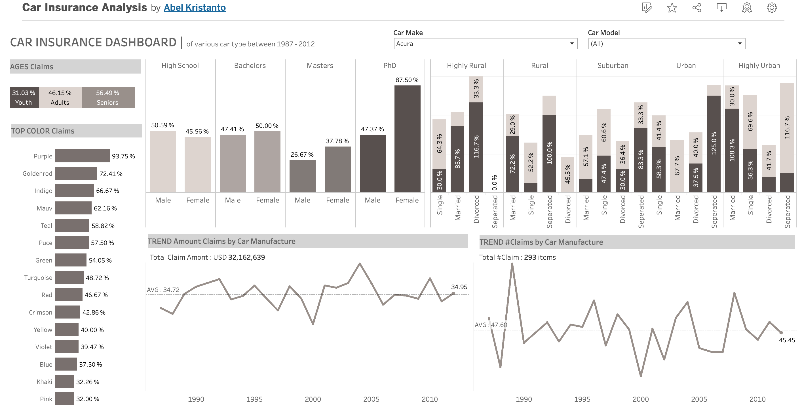
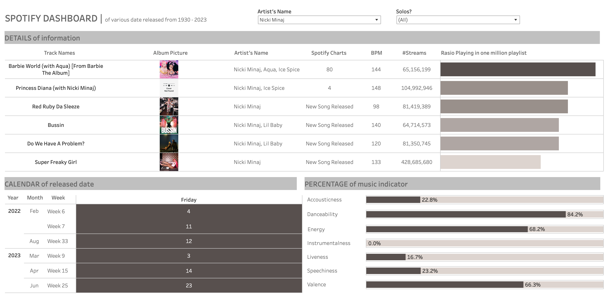
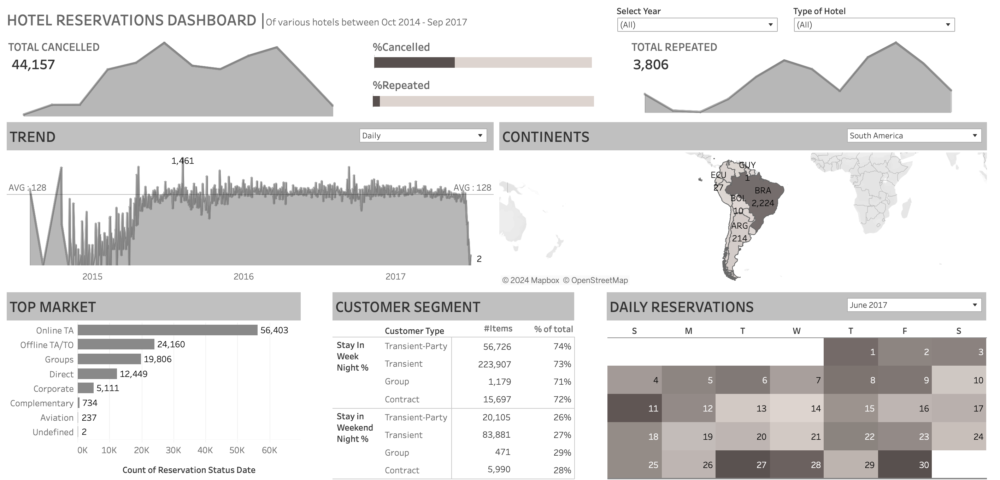
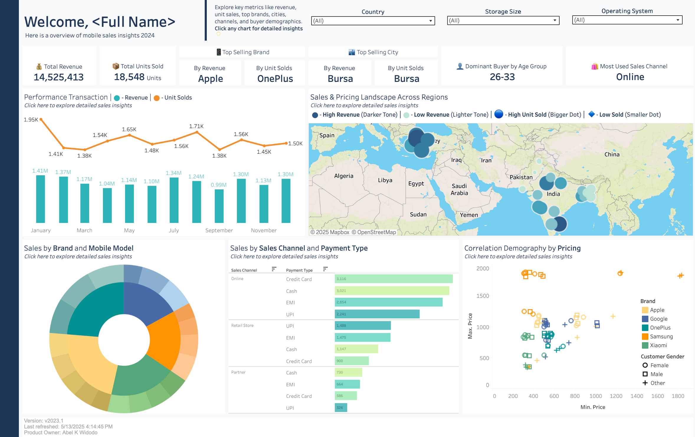

This collection highlights Abel's public Tableau dashboards. Each project is designed to turn a large dataset into a visual story that is easier to understand, compare, and act on.

## Car Insurance Analysis

This dashboard helps explain insurance claim patterns across customer demographics and vehicle-related factors. It was built to make it easier to identify trends, compare groups, and support better interpretation of claim behavior.

Review the dataset [here](https://onyxdata.ck.page/8cbde7b71b) and explore the dashboard on [Tableau Public](https://public.tableau.com/app/profile/abel.kristanto/viz/CarInsuranceAnalysis_17100849784940/Dashboard1?publish=yes).

## Spotify Analysis

This dashboard examines song popularity and engagement in the streaming era. It helps users explore artist performance, platform exposure, and musical characteristics that influence visibility and listener interest.

Review the dataset [here](https://www.kaggle.com/datasets/nelgiriyewithana/top-spotify-songs-2023) and explore the dashboard on [Tableau Public](https://public.tableau.com/app/profile/abel.kristanto/viz/SpotifyAnalysis_17101537680360/SpotifyAnalysis?publish=yes).

## Hotel Reservations Analysis

This dashboard focuses on hotel booking patterns and guest behavior. It helps explain how reservation channels, guest demographics, hotel types, and booking outcomes interact in the hospitality industry.

Review the dataset [here](https://onyxdata.co.uk/data-dna-dataset-challenge/) and explore the dashboard on [Tableau Public](https://public.tableau.com/app/profile/abel.kristanto/viz/HotelAnalysis_17101747388490/HotelAnalysis?publish=yes).

## Mobile Sales Insight 2024

This dashboard summarizes 2024 mobile sales performance through revenue, units sold, brand performance, regional distribution, and buyer demographics.

Explore the dashboard on [Tableau Public](https://public.tableau.com/app/profile/abel.kristanto/viz/Exploration_17471529452820/Overview).

